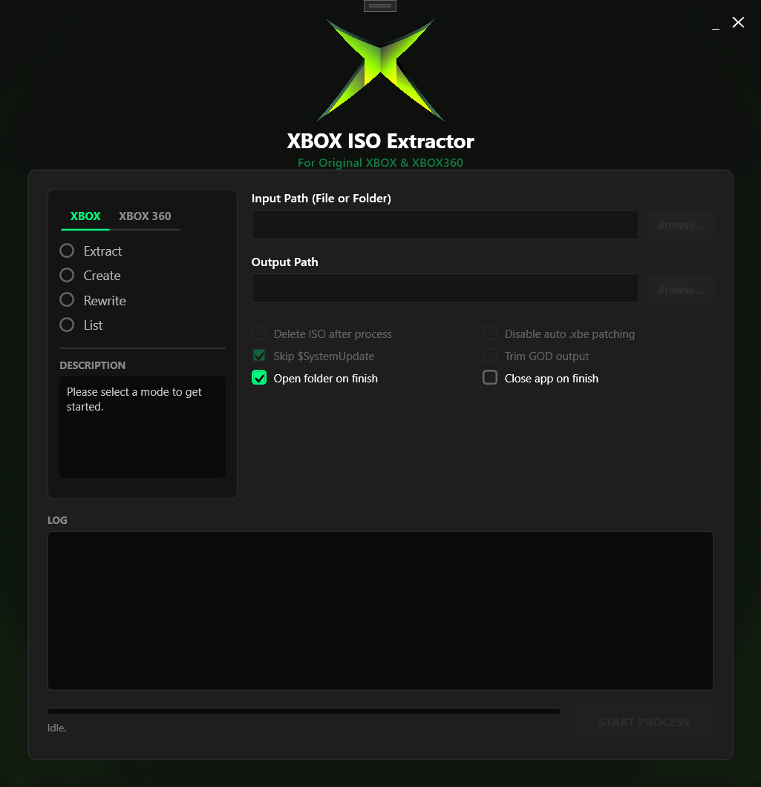

<a href="https://github.com/ilukezippo/XBOX-ISO-Extractor">
    
     
     
  </a>
  

    <h1>XBOX ISO Extractor</h1>
    Original XBOX & XBOX360
     
     
    A GUI for <a href="https://github.com/XboxDev/extract-xiso">extract-xiso</a> and <a href="https://github.com/iliazeus/iso2god-rs">iso2god</a> — extract, create, and convert Original Xbox and Xbox 360 ISOs.
     
     
    <a href="https://github.com/ilukezippo/XBOX-ISO-Extractor/issues/new?labels=bug&title=%5BBug%5D+">Report Bug</a>
    ·
    <a href="https://github.com/ilukezippo/XBOX-ISO-Extractor/issues/new?labels=enhancement&title=%5BFeature+Req%5D+">Request Feature</a>
     
     
  

  [![Forks][forks-shield]][forks-url]
  [![Stargazers][stars-shield]][stars-url]
  [![Issues][issues-shield]][issues-url]
   
  [![Downloads][dl-shield]][latest]

<!-- ABOUT THE PROJECT -->
## About The Project

XBOX ISO Extractor is an updated and enhanced version of [extract-xiso-gui by KilLo445](https://github.com/KilLo445/extract-xiso-gui), rebuilt with a modern dark UI, batch processing, live logging, and Xbox 360 support.

<!-- Replace with your own screenshot: -->
<!--  -->

### Features

**Original Xbox**
* **Extract** — Unpack one or more XISOs into folders (one subfolder per ISO)
* **Create** — Pack a game folder into a bootable XISO
* **Rewrite** — Re-pack XISOs into optimized form (strips padding)
* **List** — View an ISO's file structure without extracting

**Xbox 360**
* **Extract** — Unpack Xbox 360 ISOs into XEX game folders (for JTAG/RGH consoles)
* **Convert to GOD** — Turn ISOs into Games on Demand format via [iso2god](https://github.com/iliazeus/iso2god-rs), with optional trimming
* **List** — View an Xbox 360 ISO's file structure

**Quality of life**
* Batch processing — select or drop a whole folder of ISOs
* Drag & drop ISOs or folders straight onto the path boxes
* Live log panel with real-time progress bar, per-file status, and cancel support
* Safe deletion — source ISOs are only removed after a verified successful process
* Remembers your last-used input/output folders between sessions
* Sound notification when the queue finishes
* Skip $SystemUpdate, auto .xbe patching toggle, open-folder / close-app on finish

### Built With

* [![.NET][.NET]][framework-url]

<!-- GETTING STARTED -->
## Getting Started

### Prerequisites

.NET Framework Runtime 4.8 is required.
  - [Download page](https://dotnet.microsoft.com/en-us/download/dotnet-framework/net48)
  - [Direct (Web)](https://dotnet.microsoft.com/en-us/download/dotnet-framework/thank-you/net48-web-installer)
  - [Direct (Offline)](https://dotnet.microsoft.com/en-us/download/dotnet-framework/thank-you/net48-offline-installer)

### Installation (Portable)

1. Head over to the [latest release][latest]
2. Download `XBOX-ISO-Extractor.zip`
3. Extract all files somewhere safe
4. Run the app — it will offer to download `extract-xiso.exe` automatically on first launch. `iso2god.exe` is downloaded the same way the first time you use GOD conversion.

<!-- LICENSE -->
## License

Distributed under the MIT License. See `LICENSE.txt` for more information.

## Credits

* [KilLo445](https://github.com/KilLo445) — original [extract-xiso-gui](https://github.com/KilLo445/extract-xiso-gui) this project is based on
* [XboxDev](https://github.com/XboxDev/extract-xiso) — extract-xiso
* [iliazeus](https://github.com/iliazeus/iso2god-rs) — iso2god

## Image Credits

- Xbox X
    - [Unknown](https://i.imgur.com/DNXWFzz.png)
- Main background
    - [fartchicken22 on DeviantArt](https://www.deviantart.com/fartchicken22/art/Original-Xbox-Wallpaper-1043717500)
- About background
    - [SamBox436 on DeviantArt](https://www.deviantart.com/sambox436/art/Original-XBOX-BIOS-Wallpaper-2-952446228)

<!-- MARKDOWN LINKS & IMAGES -->
[forks-shield]: https://img.shields.io/github/forks/ilukezippo/XBOX-ISO-Extractor.svg?style=for-the-badge
[forks-url]: https://github.com/ilukezippo/XBOX-ISO-Extractor/network/members
[stars-shield]: https://img.shields.io/github/stars/ilukezippo/XBOX-ISO-Extractor.svg?style=for-the-badge
[stars-url]: https://github.com/ilukezippo/XBOX-ISO-Extractor/stargazers
[issues-shield]: https://img.shields.io/github/issues/ilukezippo/XBOX-ISO-Extractor.svg?style=for-the-badge
[issues-url]: https://github.com/ilukezippo/XBOX-ISO-Extractor/issues
[.NET]: https://img.shields.io/badge/.NET_Framework-5C2D91?style=for-the-badge&logo=.net&logoColor=white
[framework-url]: https://dotnet.microsoft.com/en-us/download/dotnet-framework
[dl-shield]: https://img.shields.io/github/downloads/ilukezippo/XBOX-ISO-Extractor/total?style=for-the-badge&label=Downloads&color=2E3440
[latest]: https://github.com/ilukezippo/XBOX-ISO-Extractor/releases/latest

<!-- README Template -->
<!-- https://github.com/othneildrew/Best-README-Template -->
